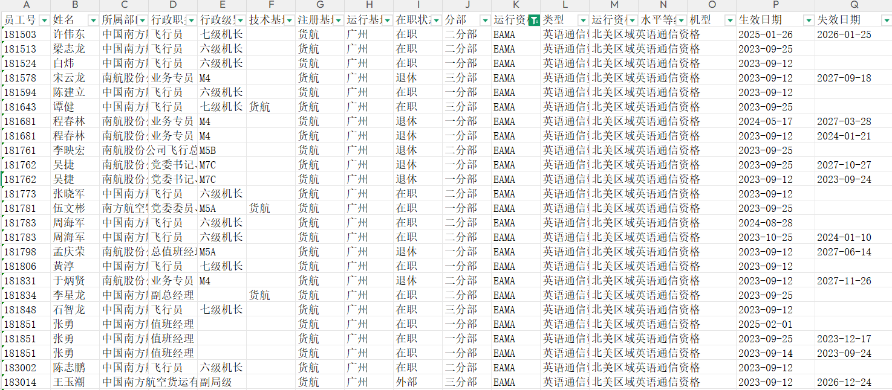
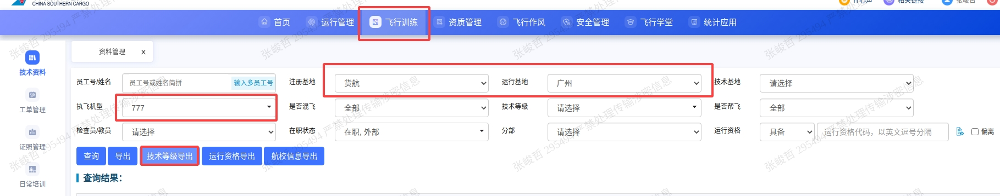
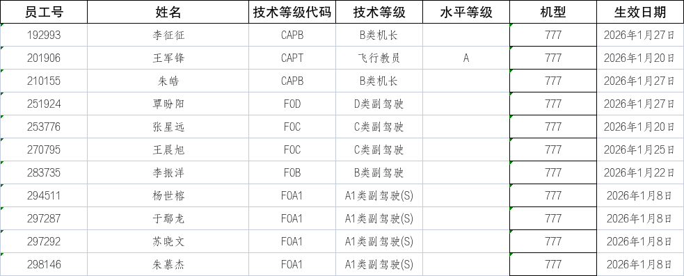
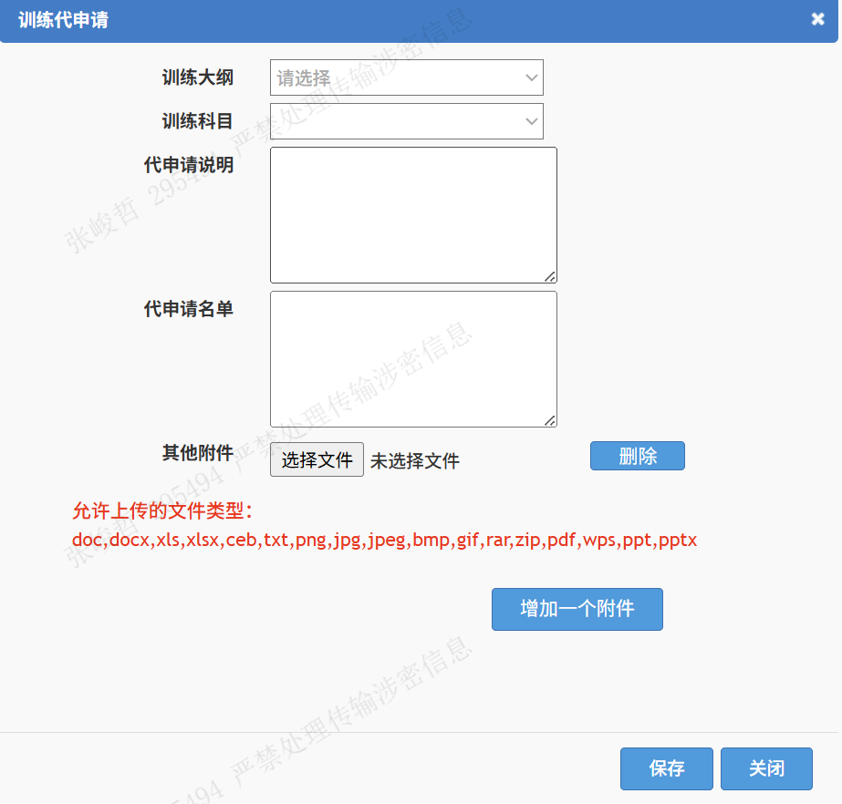
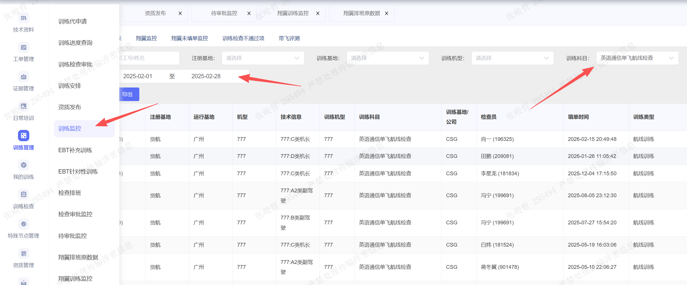

# 资质录入、统计与发布

## 资质录入时用

副驾驶资质录入前，先核对岗位表中是否已有 F/O 或 S/O，并核对资质表中的 A1/A2 等级。发布对应岗位时，A1 类副驾驶发 S/O，A2 类副驾驶发 F/O。

型别教员（B教）CAPTB，同步SIMT

改飞行学员，岗位S/S，资质表录入S/T和机型组777

退回副驾驶时，需要同步取消ACAP资质。A类B类机长包括ACAP资质，C类D类机长需要取消ACAP资质。

### 重航划转

- 档案：进入“人员基本信息”维护。
- 基地：在“人员基地”中，将基地设置为 CAN，主基地设置为 CSG。
- 非 777 机型划转：加入学员；人员岗位表录入 S/S，资质表录入资格代码 S/T，机型组录入 777。
- 非 777 机型划转人员实践考试通过后：原机长变更为 Z 类机长，原副驾驶变更为 A1 类副驾驶。

## 如何统计当前有效EAMA资质

运行资格指的是比如通讯报务、单飞等资质，如果要统计某一运行资格，以下是操作指引：

运行资格导出

运行资格筛选

## 技术等级变更统计

技术等级指的是比如A1、A2、B、C、D、ABC教等副驾驶/机长/教员的技术级别，每月需要给人力通报

导出技术资格

人力系统中仅区分副驾驶（ABCD）、机长、教员，所以需要关注的技术等级变更为：
副驾驶：FOA1，FOB，FOC，FOD
机长：CAPB
教员：CAPTA

需要关注：

令：Z类机长有1年保护期即从转机型开始1年期间享受改装待遇，1年后取消改装待遇，需要关注去年当月的转机型机长，取消改装待遇。
如：在2026年1月需要关注：

## 飞行门户资质发布流程

发布资质的全流程是：

1.层级审批（飞行员申请→分部审批→训练室审批→飞行部经理审批→总飞行师审批（如需））

或者训练代申请，可以跳过审批流程

训练待申请中填写申请人员工号。

2.指派检查

3.排班室排班，安排检查

4.检察员填单

5.审批工作单（如果检查通过）

6.发布资质

**常用操作**

**查询时间范围内的检查**

在训练监控模块中，通过选择日期和训练科目，可以查询指定时间内通过/不通过的某一指定科目。

**如何指派检查**

训练待申请 申请检查

训练安排 选择检查类型，批量安排设置时间范围，指派检查
