# 飞行人员资质笔记

## 副驾驶资质笔记

### 本场训练

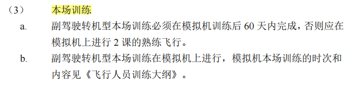

分为真飞机本场和模拟机本场，需要用真飞机做本场的情景有：
初始训练（副驾驶，进公司后第一次获取公司运行机型资格的训练，真飞机）
副驾驶升机长（真飞机，货航无这种类型）

### 120天100小时要求

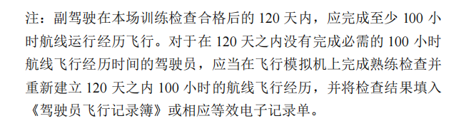

**首先复训基准月由熟练检查决定。**

**首次基准月由实践考试所在月份决定**

无法满足120天100小时的策略：
方案1：假设1月过期，2月是基准月，则排1月复训（包括一课的熟练检查）
方案2：见下图，无法通过调整基准月去覆盖，则单独排1课熟练检查（基准月变更），然后下次进行一次完整复训（包括2课复训+1课熟练检查），基准月回归原始周期。

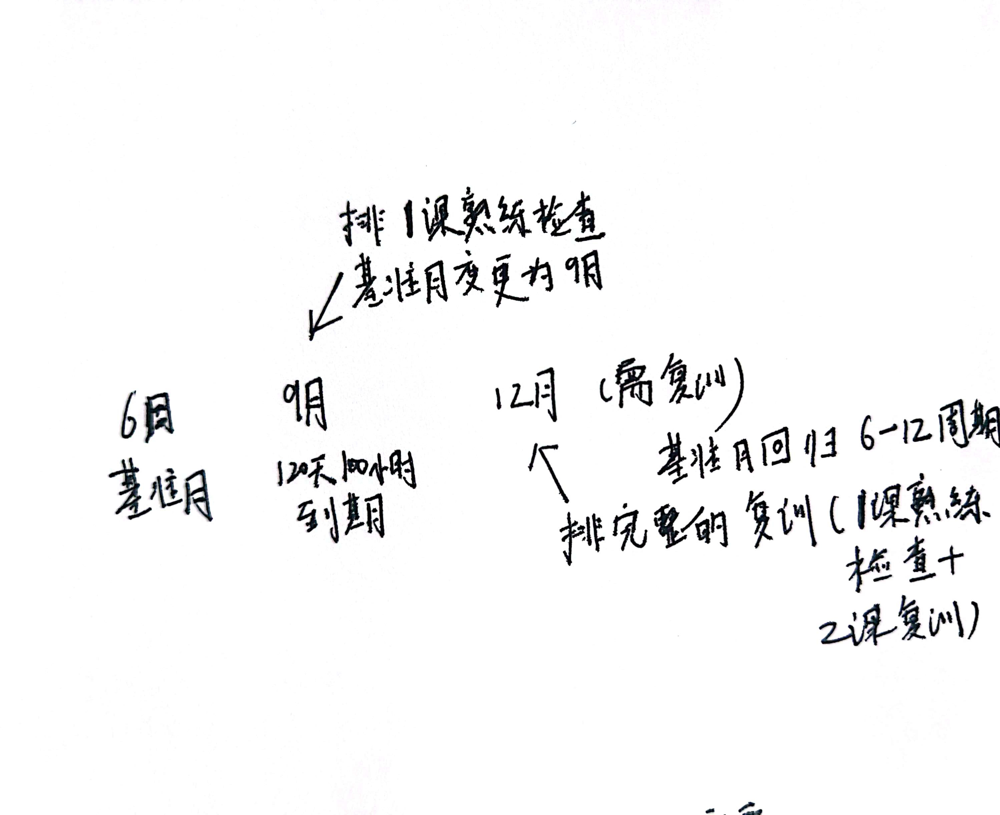

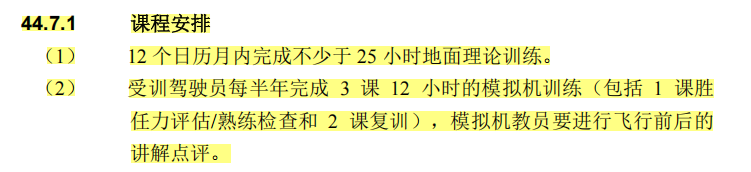

### 副驾驶航线检查

A2、B：作为 PF，1个航段
C、D：作为 PF、PM，2个航段

### 副驾驶转机型（为什么C类副驾驶后才进行流转）

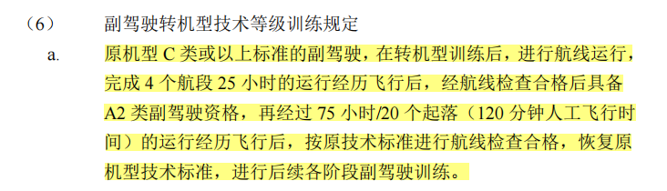

## 机长资质笔记

### 60天的时间要求

关于60天的时间要求，是来自局方的要求。通用格式是在完成XXX后的60天内，需要进入XXX训练，否则需要退回/补充XXX训练。比如：

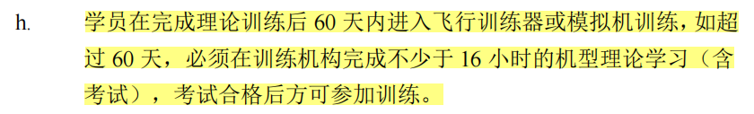

有时公司手册会沿用局方的惯例设置60天的条件。

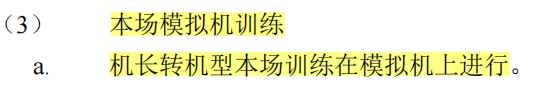

### 一检二检

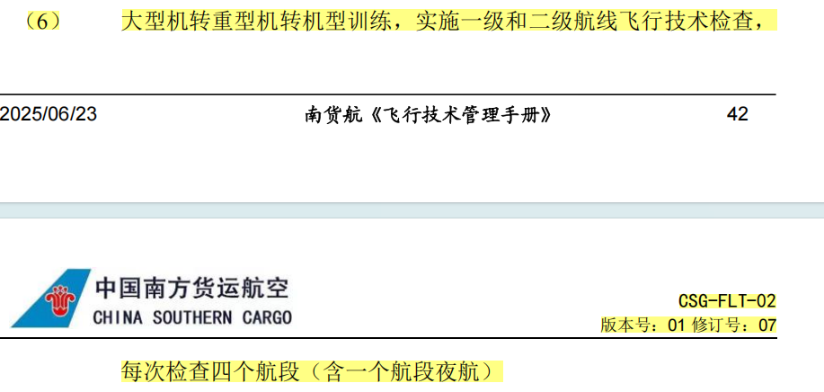

重转重只需要一检

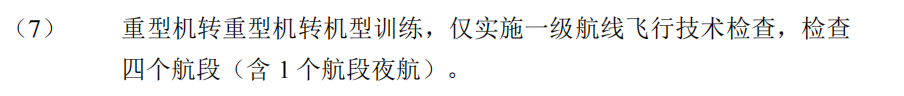

一检二检阶段在转机型之后，此阶段不能多于300小时

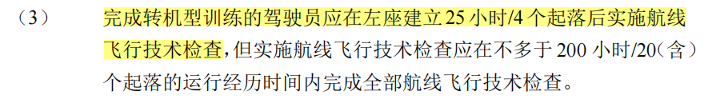

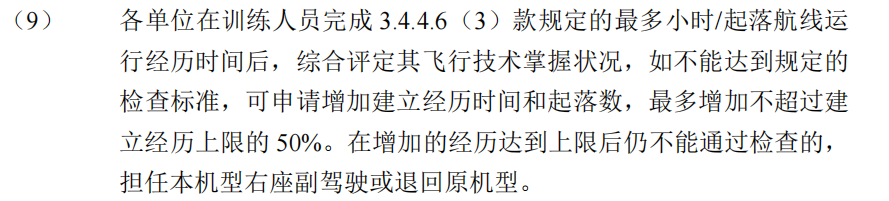

一检二检实施

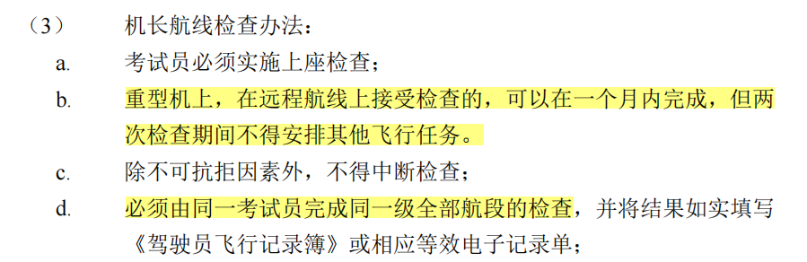

机长分级

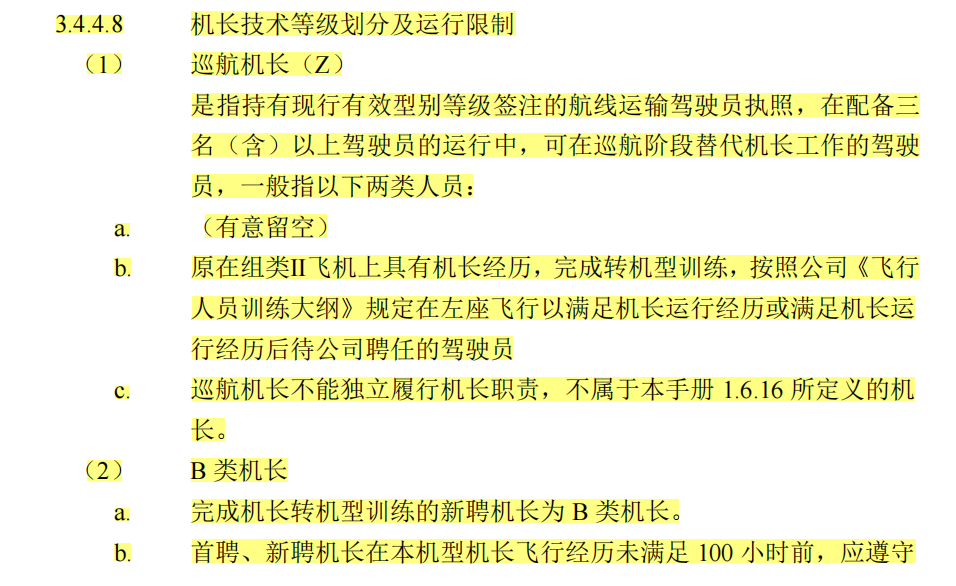

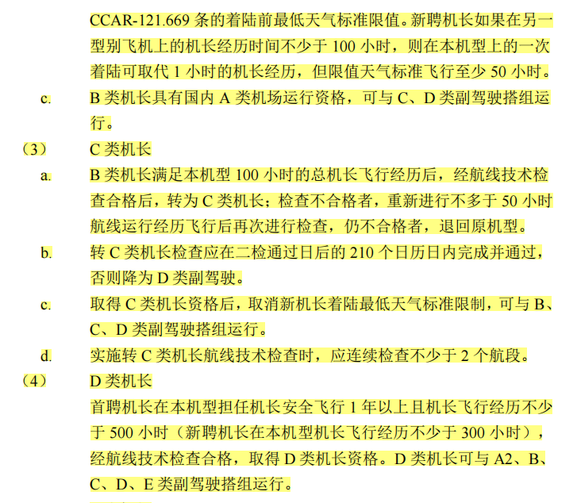

注意：实施转 C 类机长航线技术检查时，应连续检查不少于 2 个航段。C类机长是一个关键节点。

## 教员资质笔记

教员部分

目前局方分类仅有型别教员

B教

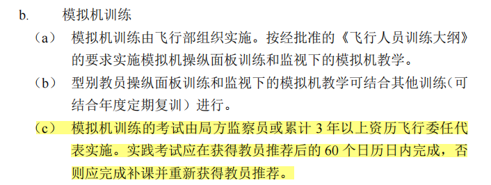

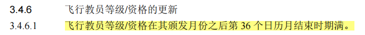

1月任意一天到3年后的1.31

复训没过，教员资格自然取消

